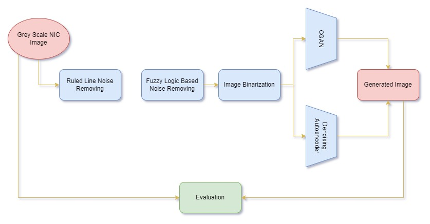

# High Performance Background and Ruled line Noise Removing.

<!-- 
 -->
  
<dt>
This research is based on introducing high performing background and ruled line noise removing technique for Sri Lanakan NIC recognition system like OCR systems. Background noise removing is done by introducing two integrated model of fuzzy filtering and machine learning noise removing methods. Since there is two major methods of noise removing technique we developed first model as integrated model of fuzzy filtering and conditional generative adversarial network. Second model  is composed of fuzzy filtering and denoising autoencoder.
</dt> 
<!-- 
 -->

The architecture of first model can be show as below.

The architecture of second model can be show as below.

The architecture of overall process can be shown as below. In order to performa integration, Generated images from fuzzy filtering was saved in google drive folder. Images from this folder was used as input to the CGAN and denoising autoencoder. According to below diagram after integrating fuzzy filtering with CGAN or denoising autoencoder final output images were compared with relative to input gray scale images of fuzzy filtering. You can find sperate source codes for fuzzy filtering, CGAN and denosing autoencoder in "code" folder. **Before runining fuzzy filtering, CGAN, and denosing autoencoder, you need to create own drive folder for holding dataset and use that drive link relevant places. For example you need to replace '/content/gdrive/MyDrive/new_nic_cropped_grayscaled_5000_glare_removed_fuzzy_filtered/' link in folder_name = os.listdir('/content/gdrive/MyDrive/new_nic_cropped_grayscaled_5000_glare_removed_fuzzy_filtered/') line to your dataset drive link path. Also before runining CGAN and denoising autoencoder you need to run fuzzy filtering source code. The output of fuzzy filtering should store in drive folder. Then you need to replace '/content/gdrive/MyDrive/new_nic_cropped_grayscaled_5000_glare_removed_fuzzy_filtered/' link with your fuzzy filtered drive link. Also you need to replace link '/content/gdrive/MyDrive/new_nic_cropped_grayscaled_5000_glare_removed/' in line image_src = cv2.imread('/content/gdrive/MyDrive/new_nic_cropped_grayscaled_5000_glare_removed/' + image_file) with your drive link path which holds input dataset to fuzzy filtering**

