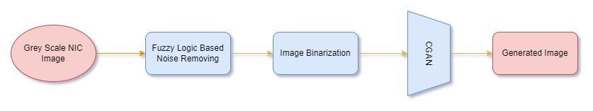

# High Performance Background and Ruled line Noise Removing.

This research is based on introducing high performing background and ruled line noise removing technique for Sri Lanakan NIC recognition system like OCR systems

